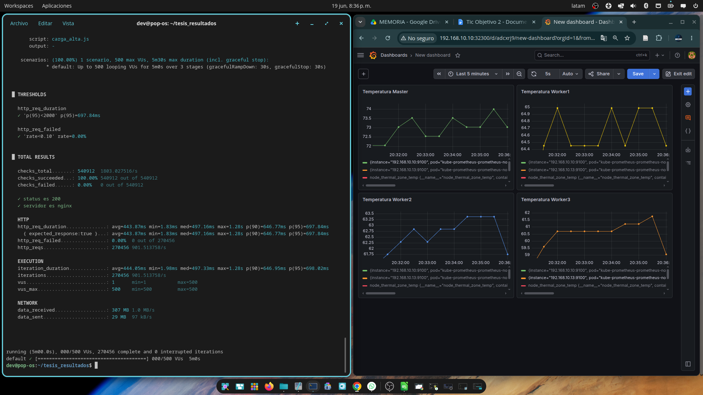
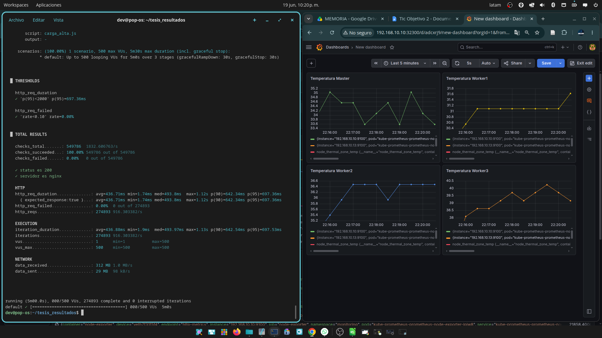
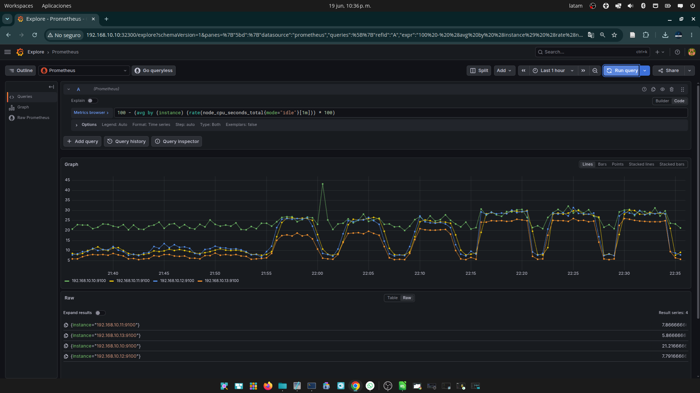

---
# ══════════════════════════════════════════════════════════════
# PÁGINA DE EVIDENCIA (para servir desde el clúster y abrir con QR)
# Versión compacta: resumen + vista 3D a la vista; el detalle va en
# secciones plegables (<details>) para que en el celular no sea larga.
# Generar:  quarto render evidencia-web/index.qmd
# Desplegar: ver evidencia-web/README.md
# ══════════════════════════════════════════════════════════════
title: "Clúster Raspberry Pi + Kubernetes"
subtitle: "Resultados y modelo 3D · Tesis de Diego Oswaldo Márquez Paccha · UNL 2026"
lang: es
format:
  html:
    embed-resources: true
    toc: false
    theme: cosmo
    css: estilo.css
    page-layout: article
    anchor-sections: false
---

```{=html}
<div class="aviso-cluster" id="aviso-origen"><p>Resultados de la tesis y modelo 3D del prototipo. Esta misma página también la sirve el clúster de la sustentación, en <b>http://192.168.10.10:32090</b> (conectado a su WiFi).</p></div>
<script>
// Si la página llega desde la red del clúster, lo dice; si llega desde internet, deja el texto neutro.
if (/^192\.168\./.test(location.hostname)) {
  document.getElementById('aviso-origen').innerHTML = '<p>Esta página te la sirve <b>el clúster que tienes al frente</b>: NGINX desplegado con Kubernetes (K3s) sobre Raspberry Pi.</p>';
}
</script>
```

<div class="cifras">
<div class="cifra"><span class="c-valor">915</span><span class="c-rotulo">peticiones/s<br>con 500 usuarios</span></div>
<div class="cifra"><span class="c-valor">700 ms</span><span class="c-rotulo">latencia p95<br>con 500 usuarios</span></div>
<div class="cifra"><span class="c-valor">0 %</span><span class="c-rotulo">de fallos<br>en 21 ejecuciones</span></div>
<div class="cifra"><span class="c-valor">464 USD</span><span class="c-rotulo">costo del<br>prototipo</span></div>
</div>

El límite del rendimiento no es la temperatura ni el procesador, sino la **red de los nodos trabajadores**: en la Raspberry Pi 3, el Ethernet pasa por el bus USB.

## El prototipo en 3D

```{=html}
<script type="module" src="lib/model-viewer.min.js"></script>
<model-viewer class="visor-3d" src="modelo/cluster.glb" data-external="1"
  alt="Modelo 3D de la carcasa modular del clúster"
  camera-controls touch-action="pan-y" auto-rotate auto-rotate-delay="1500" rotation-per-second="18deg"
  camera-orbit="35deg 68deg auto" min-camera-orbit="auto 10deg auto" max-camera-orbit="auto 100deg auto"
  shadow-intensity="1" shadow-softness="0.9" exposure="1.15" interaction-prompt="auto">
  <div class="visor-cargando" slot="poster">Cargando el modelo 3D…</div>
</model-viewer>
<p class="visor-ayuda">Arrastra para girar · pellizca para acercar · carcasa impresa en 3D, 8 piezas, 17 × 17 × 14 cm</p>
```

## Más detalle

<details>
<summary>Rendimiento por nivel de carga</summary>

::: {.tabla}

| Nivel | Escenario | Throughput (pet./s) | Lat. media (ms) | p95 (ms) |
|---|---|---|---|---|
| 50 usuarios | Sin refrig. | 39.93 ± 0.10 | 3.16 ± 0.03 | 3.66 ± 0.02 |
| 50 usuarios | Con refrig. | 39.97 ± 0.20 | 3.11 ± 0.01 | 3.60 ± 0.02 |
| 200 usuarios | Sin refrig. | 318.00 ± 0.28 | 2.99 ± 0.02 | 3.85 ± 0.03 |
| 200 usuarios | Con refrig. | 317.91 ± 0.28 | 2.95 ± 0.03 | 3.82 ± 0.05 |
| 500 usuarios | Sin refrig. | 900.82 ± 4.69 | 444.23 ± 2.31 | 701.77 ± 3.79 |
| 500 usuarios | Con refrig. | 915.50 ± 3.25 | 437.10 ± 1.55 | 700.22 ± 2.47 |

:::

Media ± desviación estándar de tres repeticiones. 0.00 % de fallos en todas. Coeficientes de variación por debajo del 0.6 %.

</details>

<details>
<summary>Temperatura: enfriar casi no mejora</summary>

::: {.tabla}

| Nodo (carga alta) | Sin refrig. (°C) | Con refrig. (°C) | Reducción |
|---|---|---|---|
| Maestro · Pi 4B | 74.33 | 34.93 | −39.40 |
| Trabajador 1 · Pi 3B+ | 65.33 | 31.60 | −33.73 |
| Trabajador 2 · Pi 3B | 63.57 | 36.67 | −26.90 |
| Trabajador 3 · Pi 3B | 61.77 | 39.87 | −21.90 |

:::

Con casi 40 °C menos, el throughput mejoró solo **1.6 %** y la latencia p95 un 0.2 %. El umbral de *thermal throttling* (80–85 °C) nunca se alcanzó.





</details>

<details>
<summary>Qué pasa por dentro bajo carga alta</summary>

- **99.1 %** del tiempo de cada petición es espera de respuesta (433.26 ms); recibir los datos toma 3.82 ms.
- Uso de CPU de los trabajadores: no superó el **28 %**.
- Enlace de red: **8.31 Mbps** sobre 100 Mbps, el 8.3 %.



</details>

<details>
<summary>Experimento: tráfico distribuido</summary>

Única variable modificada: el tráfico entra directo por los tres trabajadores en lugar de por el maestro.

::: {.tabla}

| Métrica | Centralizado | Distribuido | Diferencia |
|---|---|---|---|
| Throughput (pet./s) | 915.50 ± 3.25 | 946.96 ± 3.33 | +3.4 % |
| Latencia media (ms) | 437.10 ± 1.55 | 422.58 ± 1.47 | −3.3 % |
| Latencia p95 (ms) | 700.22 ± 2.47 | 870.13 ± 38.26 | +24.3 % |
| Latencia máxima (ms) | 1195.41 | 4339.33 | +263 % |

:::

Casi el mismo throughput y una respuesta más irregular: el límite no estaba en el maestro.

</details>

<details>
<summary>Equipos, software y costo</summary>

- **Nodos:** 1 maestro Raspberry Pi 4B (4 GB) y 3 trabajadores Raspberry Pi 3 (1 GB).
- **Red:** switch D-Link Fast Ethernet (100 Mbps) y router MikroTik.
- **Software:** Ubuntu Server 24.04.4 · K3s v1.35.5 · NGINX (3 réplicas) · Grafana K6 · Prometheus · Grafana.
- **Costo:** 464 USD, dentro del rango de la literatura (Shoop et al.: 219 USD con 3 nodos; Rodríguez-Iglesias et al.: 679 EUR con 8 nodos). Replicar la carcasa cuesta unos 50 USD de material: el modelo 3D es público.

</details>

<details>
<summary>Datos abiertos</summary>

- Scripts, configuración y datos en crudo: [github.com/eval-cluster/cluster](https://github.com/eval-cluster/cluster)
- Modelo 3D: [tinkercad.com/things/l75tymLzWOO-cluster-4-raspberrypi](https://www.tinkercad.com/things/l75tymLzWOO-cluster-4-raspberrypi)

</details>

::: {.pie}
Trabajo de Integración Curricular · Ingeniería en Ciencias de la Computación · Universidad Nacional de Loja · Director: Ing. Cristian Ramiro Narváez Guillén, Mg. Sc.
:::
