---
# ══════════════════════════════════════════════════════════════
# PRESENTACIÓN DE TESIS
# Evaluación del rendimiento de un clúster de bajo costo
# basado en Raspberry Pi orquestado con Kubernetes
# Autor: Diego Oswaldo Márquez Paccha — UNL
# Renderizar: quarto preview presentacion-tesis.qmd
# ══════════════════════════════════════════════════════════════
format:
  revealjs:
    theme: [default, css/unl-theme.css]
    logo: assets/logoUnlOscuro.png
    slide-number: true
    transition: fade
    transition-speed: fast
    background-transition: fade
    width: 1280
    height: 720
    margin: 0.08
    center: false
    hash: true
    history: true
    controls: true
    progress: true
    touch: true
    lang: es
    highlight-style: monokai
    title-slide: false
    include-in-header:
      text: |
        <script>
        // Eliminar slide vacío generado por Quarto
        document.addEventListener('DOMContentLoaded', function() {
          var slides = document.querySelectorAll('.reveal .slides > section');
          if (slides.length > 0 && slides[0].children.length === 0 && !slides[0].classList.contains('portada')) {
            slides[0].remove();
            if (typeof Reveal !== 'undefined') {
              Reveal.sync();
              Reveal.slide(0);
            }
          }
        });
        </script>
        <style>
        /* ── Diagrama de problemática (cajas alrededor de la pregunta) ── */
        .diagrama-problema {
          display: grid;
          grid-template-columns: 1fr 1.35fr 1fr;
          grid-template-rows: 1fr 1fr;
          gap: 18px;
          height: 500px;
          max-width: 1180px;
          margin: 0.3em auto 0;
          align-items: stretch;
          justify-items: stretch;
        }
        .dp-caja {
          background: var(--unl-gris-claro);
          border: 1px solid var(--unl-gris-linea);
          border-top: 4px solid var(--unl-azul-oscuro);
          border-radius: 10px;
          padding: 16px 20px;
          font-size: 0.62em;
          line-height: 1.45;
          display: flex;
          flex-direction: column;
          justify-content: center;
        }
        .dp-caja .dp-titulo {
          font-family: var(--unl-font-titulos);
          font-weight: 700;
          color: var(--unl-rojo);
          text-transform: uppercase;
          letter-spacing: 0.05em;
          font-size: 0.85em;
          margin-bottom: 4px;
        }
        .dp-centro {
          grid-column: 2;
          grid-row: 1 / 3;
          align-self: stretch;
          background: linear-gradient(135deg, var(--unl-rojo) 0%, var(--unl-rojo-oscuro) 100%);
          color: var(--unl-blanco);
          border: none;
          border-radius: 14px;
          padding: 24px 26px;
          font-size: 0.72em;
          line-height: 1.5;
          display: flex;
          flex-direction: column;
          justify-content: center;
          text-align: center;
          box-shadow: 0 8px 22px rgba(227, 6, 19, 0.35);
        }
        .dp-centro .dp-titulo-centro {
          font-family: var(--unl-font-titulos);
          font-weight: 800;
          text-transform: uppercase;
          letter-spacing: 0.08em;
          font-size: 0.8em;
          margin-bottom: 10px;
          opacity: 0.9;
        }
        .dp-centro strong { color: #FFD9DC; }
        /* ── Tarjetas de conceptos clave ── */
        .concept-grid {
          display: grid;
          grid-template-columns: repeat(2, 1fr);
          gap: 18px;
          margin-top: 0.4em;
        }
        .concept-card {
          background: var(--unl-gris-claro);
          border-left: 4px solid var(--unl-rojo);
          border-radius: 0 10px 10px 0;
          padding: 16px 20px;
          font-size: 0.66em;
          line-height: 1.45;
        }
        .concept-card b { color: var(--unl-rojo); }
        /* Tarjetas de métrica conclusiva (latencia / throughput) */
        .metric-grid { display: flex; gap: 22px; margin: 0.4em 0 0.5em; }
        .metric-card {
          flex: 1;
          background: linear-gradient(135deg, var(--unl-rojo) 0%, var(--unl-rojo-oscuro) 100%);
          color: #fff;
          border-radius: 14px;
          padding: 20px 18px;
          text-align: center;
          box-shadow: 0 6px 18px rgba(227, 6, 19, 0.3);
        }
        .metric-card .m-label {
          font-family: var(--unl-font-titulos);
          text-transform: uppercase;
          letter-spacing: 0.08em;
          font-size: 0.62em;
          font-weight: 800;
          opacity: 0.92;
        }
        .metric-card .m-value {
          font-family: var(--unl-font-titulos);
          font-size: 1.75em;
          font-weight: 800;
          line-height: 1.1;
          margin: 6px 0 4px;
        }
        .metric-card .m-sub { font-size: 0.5em; opacity: 0.95; line-height: 1.35; }
        /* Bloque de código QR con enlace */
        .qr-box {
          display: flex;
          align-items: center;
          gap: 14px;
          margin-top: 18px;
          padding: 10px 14px;
          background: var(--unl-gris-claro);
          border-left: 4px solid var(--unl-rojo);
          border-radius: 0 10px 10px 0;
        }
        .qr-box img {
          width: 118px !important;
          height: 118px !important;
          border-radius: 6px !important;
          box-shadow: none !important;
          background: #fff;
          padding: 5px;
          flex-shrink: 0;
        }
        .qr-box .qr-txt { font-size: 0.5em; line-height: 1.4; }
        .qr-box .qr-txt b { color: var(--unl-rojo); }
        .qr-box .qr-txt a { color: var(--unl-azul-oscuro); word-break: break-all; }
        /* Enlace clicable debajo del código QR */
        .reveal a.repo-link {
          display: inline-block;
          margin-top: 8px;
          font-size: 0.52em;
          font-weight: 700;
          color: var(--unl-rojo);
          background: var(--unl-gris-claro);
          border: 1px solid var(--unl-gris-linea);
          border-radius: 8px;
          padding: 6px 14px;
          word-break: break-all;
        }
        .reveal a.repo-link:hover { background: var(--unl-rojo); color: #fff; border-color: var(--unl-rojo); }
        /* Columna compacta: mantiene el tamaño de letra uniforme (0.85em);
           solo ajusta el interlineado y el margen para ganar densidad. */
        .reveal .compacto li { line-height: 1.4; margin-bottom: 0.4em; }
        .reveal .compacto .qr-box { margin-top: 10px; padding: 8px 12px; }
        .reveal .compacto .qr-box img { width: 92px !important; height: 92px !important; }
        .reveal .compacto .qr-box .qr-txt { font-size: 0.44em; }
        /* Conceptos en una sola columna (cuando acompañan a una figura) */
        .concept-col { display: flex; flex-direction: column; gap: 12px; }
        .concept-col .concept-card { font-size: 0.62em; padding: 10px 16px; }
        /* Viñeta/numeral en la misma línea que el texto */
        .reveal .slides li > p { display: inline; margin: 0; }

        /* ── Layout texto + imagen (imagen con más protagonismo) ── */
        .reveal .columnas { align-items: center; }
        .reveal .columnas .col-txt { flex: 1 1 44%; }
        .reveal .columnas .col-fig { flex: 1 1 56%; }

        /* ── Figuras como tarjetas (marco blanco + sombra + acento) ── */
        .reveal .col-fig figure,
        .reveal .col-fig .quarto-figure {
          margin: 0 auto !important;
          background: #ffffff;
          padding: 10px 10px 0 10px;
          border: 1px solid var(--unl-gris-linea);
          border-radius: 12px;
          box-shadow: 0 8px 22px rgba(0, 0, 0, 0.16);
          display: inline-block;
          max-width: 100%;
        }
        .reveal .col-fig figure img,
        .reveal .col-fig img {
          max-height: 420px;
          width: auto;
          max-width: 100%;
          display: block;
          margin: 0 auto;
          border-radius: 6px 6px 0 0 !important;
          box-shadow: none !important;
        }
        .reveal .col-fig figcaption,
        .reveal .col-fig .figure-caption {
          font-size: 0.42em;
          line-height: 1.3;
          color: var(--unl-gris-oscuro);
          text-align: center;
          font-style: italic;
          border-top: 3px solid var(--unl-rojo);
          padding: 7px 6px 8px 6px;
          margin-top: 8px;
        }

        /* Dos figuras apiladas dentro de una columna */
        .reveal .col-fig.stack { display: flex; flex-direction: column; gap: 12px; align-items: center; }
        .reveal .col-fig.stack figure { padding: 7px 7px 0 7px; }
        .reveal .col-fig.stack figure img,
        .reveal .col-fig.stack img { max-height: 190px; }
        .reveal .col-fig.stack figcaption,
        .reveal .col-fig.stack .figure-caption {
          font-size: 0.36em;
          padding: 5px 4px 5px 4px;
          margin-top: 5px;
          border-top-width: 2px;
        }

        /* Imagen a lo ancho (centrada) para slides muy visuales */
        .reveal .fig-ancha { text-align: center; width: 100%; }
        .reveal .fig-ancha figure, .reveal .fig-ancha .quarto-figure {
          margin: 0.2em auto !important;
          background: #fff;
          padding: 10px 10px 0 10px;
          border: 1px solid var(--unl-gris-linea);
          border-radius: 12px;
          box-shadow: 0 8px 22px rgba(0,0,0,0.16);
          display: inline-block;
        }
        .reveal .fig-ancha img { max-height: 460px; width: auto; max-width: 100%; border-radius: 6px 6px 0 0 !important; box-shadow: none !important; }
        .reveal .fig-ancha figcaption, .reveal .fig-ancha .figure-caption {
          font-size: 0.4em; color: var(--unl-gris-oscuro); text-align: center; font-style: italic;
          border-top: 3px solid var(--unl-rojo); padding: 6px; margin-top: 6px;
        }

        /* ══════════════════════════════════════════════════════
           ANIMACIONES E INTERACTIVIDAD
           ══════════════════════════════════════════════════════ */
        @keyframes unlFadeUp   { from { opacity: 0; transform: translateY(20px); } to { opacity: 1; transform: none; } }
        @keyframes unlFadeLeft { from { opacity: 0; transform: translateX(-26px); } to { opacity: 1; transform: none; } }
        @keyframes unlZoomIn   { from { opacity: 0; transform: scale(0.90); } to { opacity: 1; transform: none; } }
        @keyframes unlFade     { from { opacity: 0; } to { opacity: 1; } }
        @keyframes unlPop      { 0% { opacity: 0; transform: scale(0.6); } 70% { transform: scale(1.06); } 100% { opacity: 1; transform: none; } }

        @media (prefers-reduced-motion: no-preference) {
          .reveal section.present .concept-card { animation: unlFadeUp 0.5s ease both; }
          .reveal section.present .concept-card:nth-child(1) { animation-delay: 0.05s; }
          .reveal section.present .concept-card:nth-child(2) { animation-delay: 0.15s; }
          .reveal section.present .concept-card:nth-child(3) { animation-delay: 0.25s; }
          .reveal section.present .concept-card:nth-child(4) { animation-delay: 0.35s; }
          .reveal section.present .dp-centro { animation: unlPop 0.6s cubic-bezier(0.34,1.3,0.5,1) both; }
          .reveal section.present .metric-card { animation: unlPop 0.6s cubic-bezier(0.34,1.3,0.5,1) both; }
          .reveal section.present .metric-card:nth-child(2) { animation-delay: 0.14s; }
          .reveal section.present .caja-importante,
          .reveal section.present .caja-info { animation: unlFadeLeft 0.55s ease both; animation-delay: 0.12s; }
          .reveal section.present .col-fig figure,
          .reveal section.present .col-fig .quarto-figure,
          .reveal section.present .fig-ancha figure,
          .reveal section.present .fig-ancha .quarto-figure { animation: unlZoomIn 0.55s ease both; }
          .reveal section.present .col-fig.stack figure:nth-of-type(2) { animation-delay: 0.18s; }
          .reveal section.present table { animation: unlFade 0.7s ease both; animation-delay: 0.1s; }
          .reveal section.present .numero-seccion { animation: unlZoomIn 0.7s ease both; }
        }

        .reveal .concept-card,
        .reveal .dp-caja,
        .reveal .col-fig figure,
        .reveal .fig-ancha figure { transition: transform 0.2s ease, box-shadow 0.2s ease; }
        .reveal .concept-card:hover,
        .reveal .dp-caja:hover { transform: translateY(-4px); box-shadow: 0 10px 22px rgba(227, 6, 19, 0.16); }
        .reveal .col-fig figure:hover,
        .reveal .fig-ancha figure:hover { transform: translateY(-5px); box-shadow: 0 16px 34px rgba(0, 0, 0, 0.24); }
        </style>
---

<!-- ═══════════════ 1 · CARÁTULA ═══════════════ -->

## {.portada data-state="portada" data-menu-title="Carátula" data-background-color="#FFFFFF"}

::: {.portada-panel-rojo}


:::

::: {.portada-panel-blanco}
<p class="cover-institucion">Universidad Nacional de Loja</p>
<p class="cover-facultad">Facultad de la Energía, las Industrias y los Recursos Naturales No Renovables · Ingeniería en Ciencias de la Computación</p>

<h2 class="cover-titulo">Evaluación del rendimiento de un clúster de bajo costo basado en Raspberry Pi orquestado con Kubernetes</h2>

<div class="cover-linea"></div>

<div class="cover-info">
<div class="cover-row"><span class="cover-label">Autor</span> Diego Oswaldo Márquez Paccha</div>
<div class="cover-row"><span class="cover-label">Director</span> Ing. Cristian Ramiro Narváez Guillén, Mg. Sc.</div>
<div class="cover-row"><span class="cover-label">Loja – Ecuador</span> 2026</div>
</div>
:::


<!-- ═══════════════ 2 · AGENDA ═══════════════ -->

## Agenda {.indice data-menu-title="Agenda"}

- Problemática y pregunta de investigación
- Objetivos
- Objetivo 1 — Construcción del prototipo físico
- Objetivo 2 — Evaluación del rendimiento
- Discusión de resultados
- Conclusiones y recomendaciones


<!-- ═══════════════ 3 · PROBLEMÁTICA + PREGUNTA ═══════════════ -->

## Problemática y Pregunta {data-menu-title="Problemática"}

<div class="diagrama-problema">

<div class="dp-caja fragment" data-fragment-index="1">
<span class="dp-titulo">Contexto</span>
Depender de la nube comercial y de servidores tradicionales es una <b>barrera de costo</b> para universidades y entornos con pocos recursos.
</div>

<div class="dp-centro">
<span class="dp-titulo-centro">Pregunta de investigación</span>
¿Cuál es el <strong>tiempo de respuesta</strong> y la <strong>cantidad de peticiones por segundo</strong> de un clúster con <strong>Kubernetes</strong> para aplicaciones web, al someterlo a una <strong>carga</strong> en una arquitectura de <strong>bajo costo</strong>?
</div>

<div class="dp-caja fragment" data-fragment-index="2">
<span class="dp-titulo">Limitación</span>
Equipos de poca capacidad, sobre todo en <b>red</b>: en la Raspberry Pi 3 la red pasa por el <b>puerto USB</b>.
</div>

<div class="dp-caja fragment" data-fragment-index="3">
<span class="dp-titulo">Alternativa</span>
Un <b>clúster de Raspberry Pi</b> con una versión ligera de Kubernetes: económico y reproducible.
</div>

<div class="dp-caja fragment" data-fragment-index="4">
<span class="dp-titulo">Vacío</span>
Poca evidencia real de su <b>rendimiento bajo carga</b> y de <b>qué lo limita</b>.
</div>

</div>


<!-- ═══════════════ 3 · CONCEPTOS CLAVE ═══════════════ -->

## Conceptos clave {data-menu-title="Conceptos clave"}

::: {.columnas}
::: {.col-txt}

<div class="concept-col">

<div class="concept-card">
<b>Clúster</b> — varias computadoras que trabajan juntas como si fueran una sola.
</div>

<div class="concept-card">
<b>Kubernetes y K3s</b> — coordinan las aplicaciones; K3s es la versión ligera para equipos pequeños.
</div>

<div class="concept-card">
<b>Maestro y trabajadores</b> — el maestro coordina; los trabajadores ejecutan las aplicaciones.
</div>

<div class="concept-card">
<b>Latencia y throughput</b> — el tiempo de respuesta y las peticiones por segundo: las métricas del estudio.
</div>

<div class="concept-card">
<b>Freno por calor</b> — a 80–85 °C el equipo baja la velocidad del procesador para protegerse.
</div>

</div>

:::
::: {.col-fig}

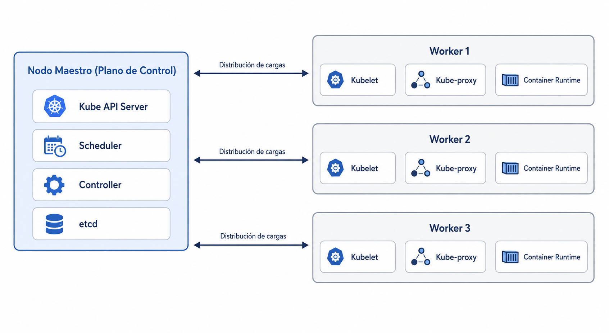

:::
:::


<!-- ═══════════════ 4 · OBJETIVOS ═══════════════ -->

## Objetivos {data-menu-title="Objetivos"}

### Objetivo General

::: {.caja-importante}
Medir el nivel de **latencia** y **throughput** que presenta un clúster orquestado con Kubernetes para el despliegue de aplicaciones web contenerizadas, al someterse a una simulación de carga en una arquitectura de bajo costo.
:::

### Objetivos Específicos

::: {.incremental}

1. **Construir el prototipo físico** del clúster de bajo costo, abarcando desde el diseño de la topología de red hasta la instalación y configuración base del sistema operativo en los nodos, para garantizar una base estable y funcional al momento de la orquestación con Kubernetes.

2. **Orquestar el despliegue de aplicaciones web** en el clúster mediante Kubernetes, sometiendo el sistema a simulaciones de carga para registrar las métricas de latencia y throughput.

:::


<!-- ═══════════════ 5 · SECCIÓN OBJETIVO 1 ═══════════════ -->

## Objetivo 1 — Construcción del prototipo físico {.seccion data-state="portada" data-menu-title="► Objetivo 1"}

<span class="numero-seccion">01</span>


<!-- ─── 6 · METODOLOGÍA OBJ 1 — DISEÑO ─── -->

## Metodología — Diseño de la carcasa {data-menu-title="Objetivo 1 · Diseño"}

::: {.columnas}
::: {.col-fig}

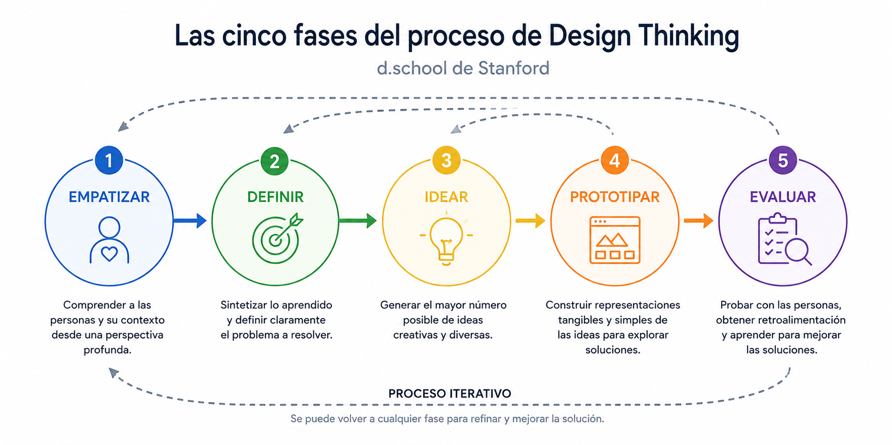

:::
::: {.col-fig}

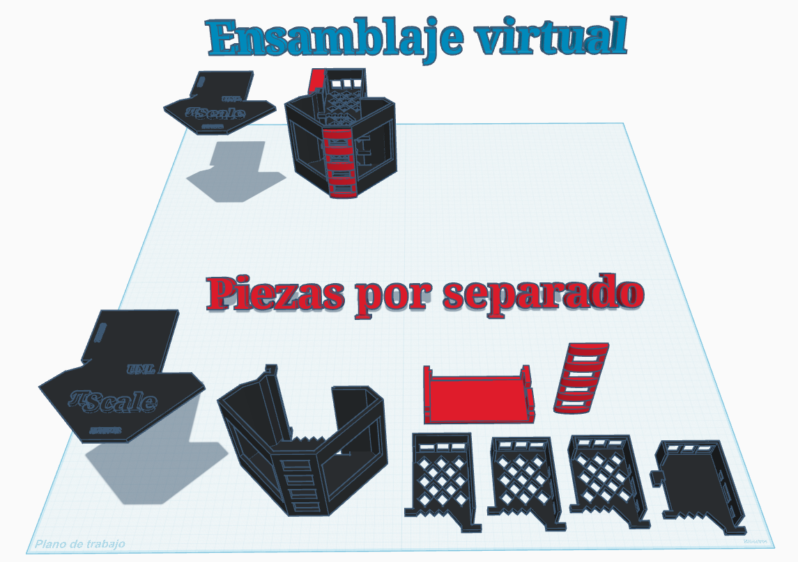

:::
:::


<!-- ─── 7 · METODOLOGÍA OBJ 1 — EQUIPOS Y RED ─── -->

## Metodología — Equipos y red {data-menu-title="Objetivo 1 · Equipos"}

::: {.columnas}
::: {.col-txt}

- **1 nodo maestro** (Raspberry Pi 4) que coordina
- **3 trabajadores** (Raspberry Pi 3) que ejecutan
- Conmutador y enrutador de red
- **Direcciones de red fijas** para cada nodo

:::
::: {.col-fig}

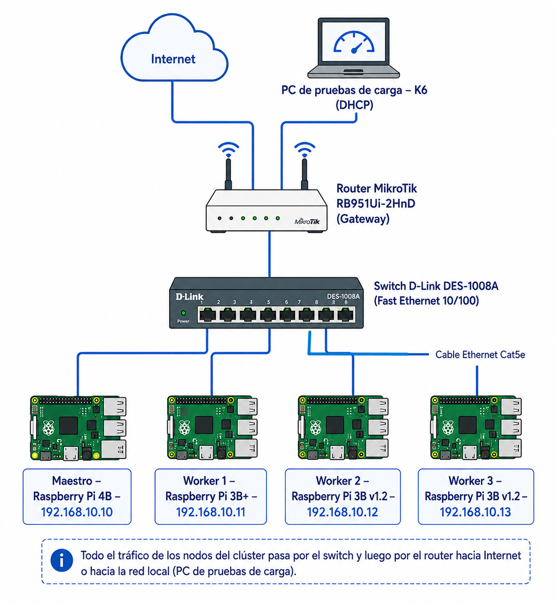

:::
:::


<!-- ─── METODOLOGÍA OBJ 1 — PREPARACIÓN Y ORQUESTACIÓN ─── -->

## Metodología — Preparación y orquestación {data-menu-title="Objetivo 1 · Configuración"}

::: {.columnas}
::: {.col-txt .compacto}

- **Sistema estable:** se **bloquearon las versiones** del núcleo (kernel) y el firmware, y se desactivaron las actualizaciones automáticas → un entorno que no cambia entre pruebas.
- **Orquestación con K3s:** primero el nodo maestro, luego cada trabajador se une al clúster.
- **Pantallas por nodo:** un programa en Python muestra en vivo el procesador, la temperatura y la memoria.

<div class="qr-box">

<span class="qr-txt"><b>Todos los comandos</b><br>Escanea el código o visita:<br><a href="https://github.com/eval-cluster/cluster">github.com/eval-cluster/cluster</a></span>
</div>

:::
::: {.col-txt}

``` bash
# Bloquear versiones del núcleo y firmware
sudo apt-mark hold linux-image-raspi \
  linux-headers-raspi linux-raspi linux-firmware

# Instalar K3s en el nodo maestro (sin Traefik)
curl -sfL https://get.k3s.io | sh -s - --disable traefik

# Unir un trabajador al clúster
curl -sfL https://get.k3s.io | \
  K3S_URL=https://192.168.10.10:6443 \
  K3S_TOKEN=<token> sh -
```

:::
:::


<!-- ─── 8 · RESULTADOS OBJ 1 — PROTOTIPO ─── -->

## Resultado — Prototipo físico {data-menu-title="Objetivo 1 · Prototipo"}

::: {.columnas}
::: {.col-txt}

- Carcasa **impresa en 3D**: 4 nodos, ventiladores y conmutador en un solo cuerpo
- Una **pantalla por nodo** con su estado en vivo
- **Bajo costo:** ~464 dólares → hasta **87 % de ahorro** frente a la nube

<div class="qr-box">

<span class="qr-txt"><b>Diseño 3D del clúster</b><br>Escanea el código o visita:<br><a href="https://www.tinkercad.com/things/l75tymLzWOO-cluster-4-raspberrypi">tinkercad.com/things/cluster-4-raspberrypi</a></span>
</div>

:::
::: {.col-fig .stack}

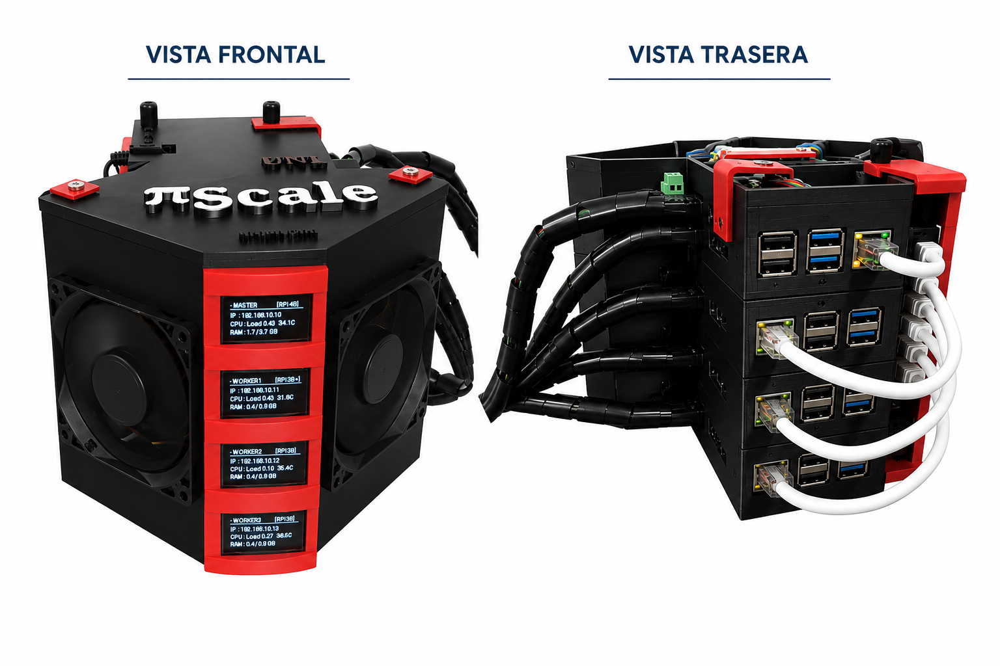

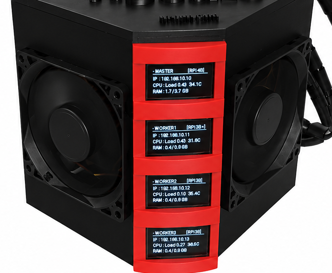

:::
:::


<!-- ─── 9 · RESULTADOS OBJ 1 — FUNCIONANDO ─── -->

## Resultado — Clúster operativo {data-menu-title="Objetivo 1 · Funcionando"}

::: {.columnas}
::: {.col-txt}

- Los **4 nodos activos** y reconocidos por Kubernetes (K3s)
- **Ningún fallo** de nodo en las 21 ejecuciones → un entorno **estable y determinista**

:::
::: {.col-fig}

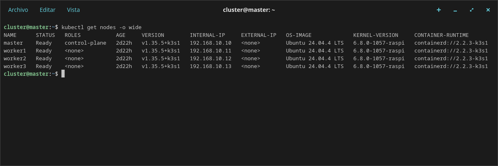

:::
:::


<!-- ═══════════════ 10 · SECCIÓN OBJETIVO 2 ═══════════════ -->

## Objetivo 2 — Evaluación del rendimiento {.seccion data-state="portada" data-menu-title="► Objetivo 2"}

<span class="numero-seccion">02</span>


<!-- ─── 11 · METODOLOGÍA OBJ 2 — CÓMO SE MIDIÓ ─── -->

## Metodología — Cómo se midió {data-menu-title="Objetivo 2 · Cómo se midió"}

::: {.columnas}
::: {.col-txt}

- **Dos escenarios:** con y sin ventiladores. Aplicación de prueba: el servidor web **NGINX**.
- **Tres niveles de carga:** 50, 200 y 500 usuarios simultáneos (uso normal, intermedio y exigencia máxima).
- **Monitoreo** del procesador, la red y la temperatura con **Prometheus y Grafana**.

:::
::: {.col-fig}

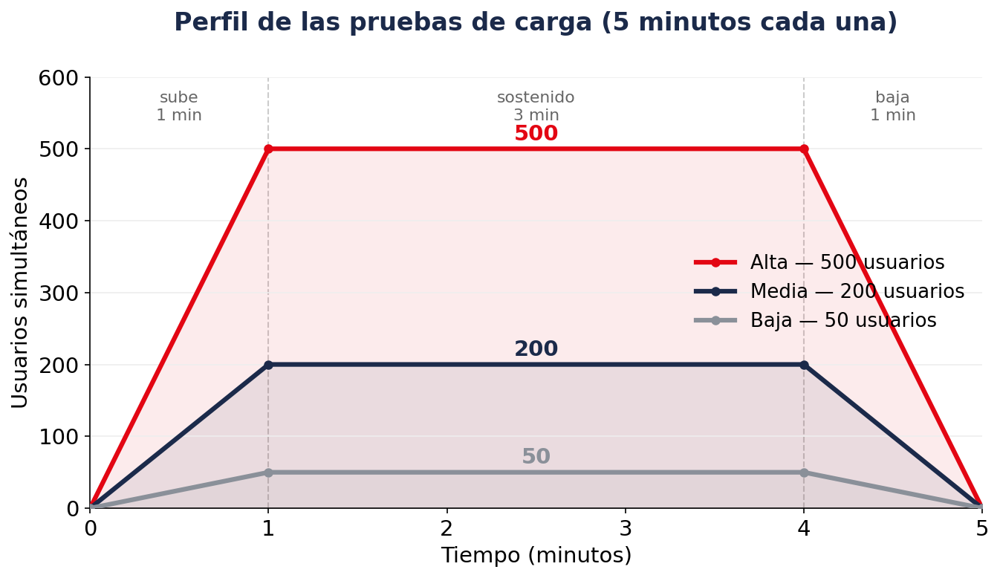

:::
:::


<!-- ─── 12 · METODOLOGÍA OBJ 2 — CUELLO DE BOTELLA ─── -->

## Metodología — Hallar el cuello de botella {data-menu-title="Objetivo 2 · Cuello de botella"}

::: {.columnas}
::: {.col-fig}

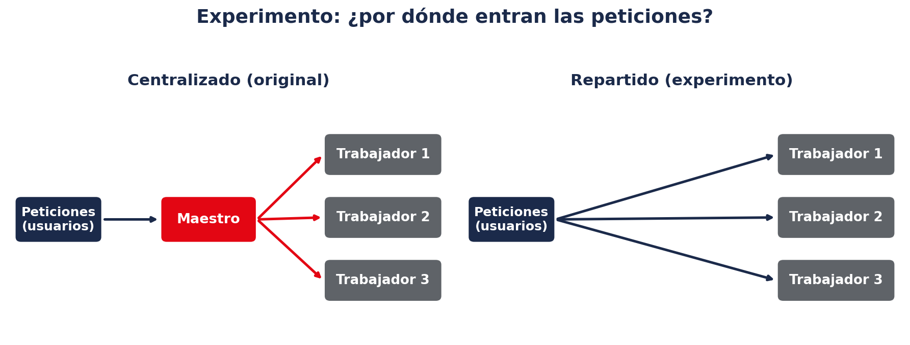

:::
::: {.col-txt}

Experimento extra: en lugar de enviar todo al maestro, se **reparten** las peticiones entre los trabajadores.

::: {.caja-importante}
Si repartir **mejora mucho** → el problema era la concentración en el maestro.

Si **no mejora** → el problema está en la **red de los trabajadores**.
:::

:::
:::


<!-- ─── RESULTADOS OBJ 2 — DESPLIEGUE NGINX ─── -->

## Resultado — Despliegue de la aplicación web {data-menu-title="Objetivo 2 · Despliegue"}

::: {.columnas}
::: {.col-txt}

- Se desplegó el servidor web **NGINX con 3 réplicas**, repartidas por Kubernetes en los **3 nodos trabajadores**.
- Confirma que **K3s orquesta** correctamente sobre hardware embebido, incluso en nodos de solo **1 GB de RAM**.

:::
::: {.col-fig}

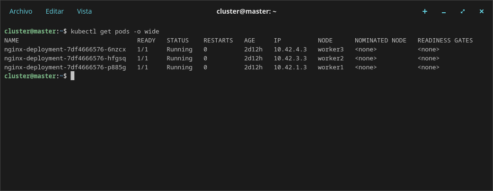

:::
:::


<!-- ─── 13 · RESULTADOS OBJ 2 — RENDIMIENTO ─── -->

## Resultado — Rendimiento por carga {data-menu-title="Objetivo 2 · Rendimiento"}

::: {.columnas}
::: {.col-fig}

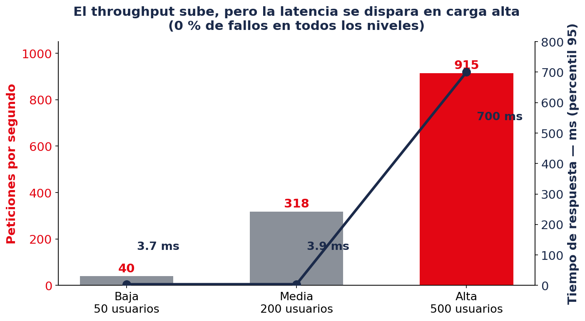

:::
::: {.col-txt}

- El **throughput** crece con la carga: de 40 a **915** peticiones por segundo.
- La **latencia** se mantiene baja hasta 200 usuarios y **se dispara** a 700 ms en carga alta.

::: {.caja-importante}
Responde bien hasta 200 usuarios y **se satura en 500** — más lento, pero **sin un solo fallo**.
:::

:::
:::


<!-- ─── 14 · RESULTADOS OBJ 2 — TEMPERATURA Y ENFRIAMIENTO ─── -->

## Resultado — Enfriar casi no mejora {data-menu-title="Objetivo 2 · Enfriamiento"}

::: {.columnas}
::: {.col-txt}

- Los ventiladores bajaron la temperatura del maestro de **74 °C a 35 °C**.
- Pero el rendimiento **apenas cambió**: solo **1.6 %** más peticiones por segundo.

::: {.caja-importante}
La temperatura **no limita** el rendimiento web, porque el procesador **nunca trabaja al límite**.
:::

:::
::: {.col-fig}

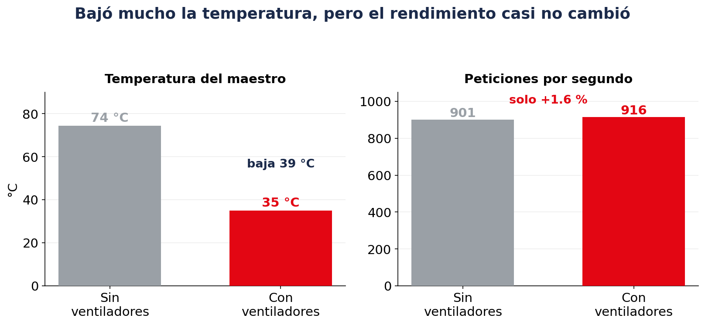

:::
:::


<!-- ─── 15 · RESULTADOS OBJ 2 — ANÁLISIS INTERNO ─── -->

## Resultado — Qué está pasando por dentro {data-menu-title="Objetivo 2 · Análisis interno"}

::: {.columnas}
::: {.col-txt}

- El **procesador** quedó casi libre (menos del 28 %)
- La **red** se usó solo al 8 %
- Casi todo el tiempo (**99 %**) se va **esperando la respuesta**, no enviando datos

::: {.caja-importante}
Ni el procesador ni la red están saturados: el problema **no es la potencia, sino la espera**.
:::

:::
::: {.col-fig}

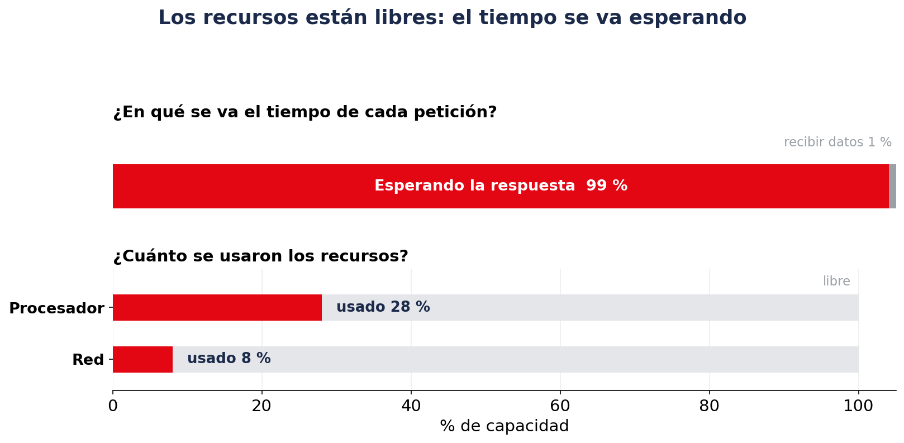

:::
:::


<!-- ─── 16 · RESULTADOS OBJ 2 — CUELLO DE BOTELLA ─── -->

## Resultado — Repartir la carga desde la PC {data-menu-title="Objetivo 2 · Experimento"}

::: {.columnas}
::: {.col-txt}

- Desde la PC de pruebas se **repartió la carga** directamente entre los 3 trabajadores, en vez de enviarla toda al maestro.

::: {.caja-importante}
**No era la concentración en el maestro:** el throughput apenas subió (**3.4 %**) y la respuesta se volvió **más irregular**. Cada trabajador recibe el tráfico por su **propia conexión (puerto USB)**, igual de limitada.
:::

:::
::: {.col-fig}

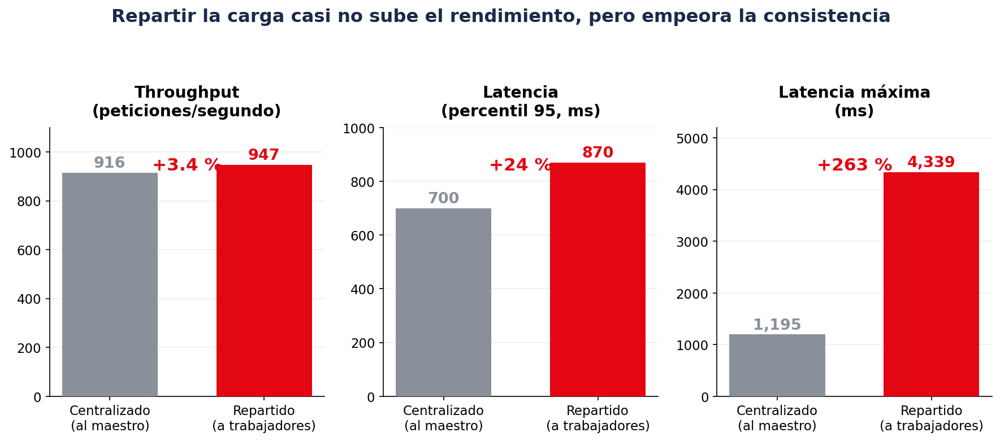

:::
:::


<!-- ─── RESULTADO — CUELLO DE BOTELLA (SÍNTESIS) ─── -->

## Resultado — El cuello de botella {data-menu-title="Objetivo 2 · Factor limitante"}

::: {.fig-ancha}
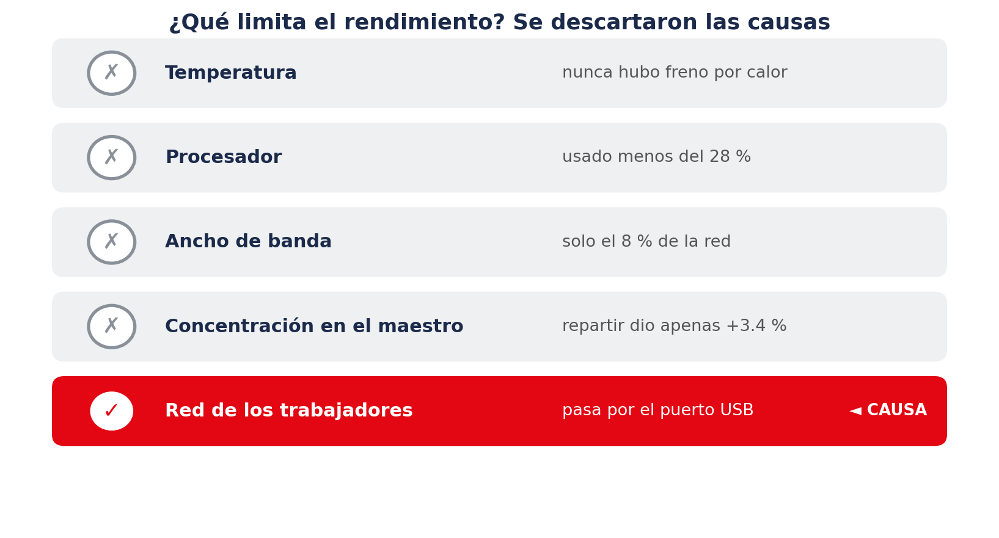
:::

::: {.caja-importante}
Lo que limita el rendimiento es la **red de los nodos trabajadores**: en la Raspberry Pi 3 la conexión pasa por el **puerto USB**, y eso hace lento el manejo de cada petición.
:::


<!-- ═══════════════ 17 · SECCIÓN DISCUSIÓN ═══════════════ -->

## Discusión {.seccion data-state="portada" data-menu-title="► Discusión"}

<span class="numero-seccion">03</span>


<!-- ─── 18 · DISCUSIÓN — COMPARACIÓN ─── -->

## Discusión — Comparación con otros estudios {data-menu-title="Discusión · Comparación"}

::: {.columnas}
::: {.col-txt}

- **Enfriamiento (Benoit-Cattin y otros):** lograron gran mejora, pero con **inteligencia artificial**, que exige mucho al procesador. Una carga web no lo hace.
- **Tiempo de respuesta (Sidharta y otros):** con Raspberry Pi 4 y red rápida tuvieron más demora que nosotros → la **configuración** pesa tanto como el equipo.
- **Costo y fiabilidad:** ~464 dólares (en línea con Shoop y Sankiti) y **ningún fallo**, frente a las fallas de Lakshminarayanan.

:::
::: {.col-fig}

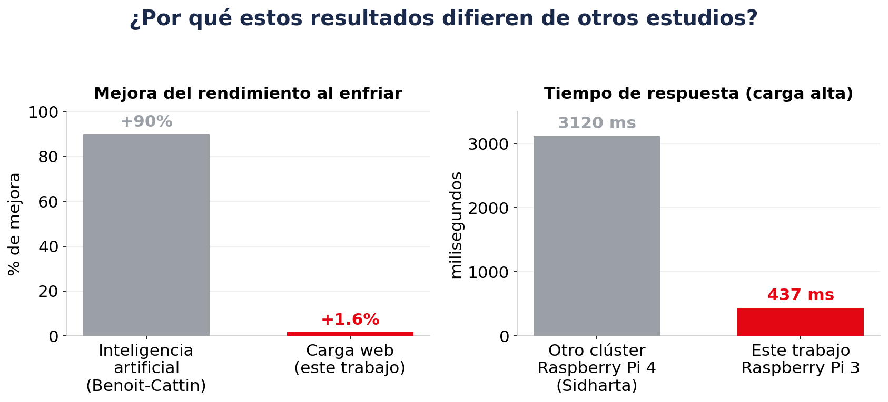

:::
:::

::: {.caja-importante}
El **freno por calor solo aparece con tareas que exigen mucho al procesador**. Una carga web no lo hace: por eso enfriar no mejora el rendimiento.
:::


<!-- ─── 19 · DISCUSIÓN — IMPLICACIONES Y LIMITACIONES ─── -->

## Discusión — Qué significa {data-menu-title="Discusión · Implicaciones"}

- Para cargas web, conviene invertir primero en **mejor red**, no en enfriamiento.
- El enfriamiento igual sirve: **protege los equipos** (más vida útil) y los prepara para **tareas más exigentes** en el futuro.
- Con esto queda claro **qué mejorar primero** en un clúster de este tipo.


<!-- ─── DISCUSIÓN — ALCANCE Y LIMITACIONES ─── -->

## Discusión — Hasta dónde llega este trabajo {data-menu-title="Discusión · Limitaciones"}

- **Repeticiones:** 3 por prueba → tendencias claras y consistentes, pero **no un análisis estadístico formal**.
- **Un solo tipo de carga:** páginas web sencillas, que no exigen al procesador. Otras cargas (bases de datos, inteligencia artificial, archivos grandes) podrían tener **otro factor limitante** e incluso activar el freno por calor.
- **Equipos distintos entre sí:** un maestro Raspberry Pi 4 y tres trabajadores Raspberry Pi 3 de dos versiones → refleja un caso real, pero **dificulta aislar cada variable**.
- **Sin grupo de comparación:** no se probó un clúster con red dedicada; la conclusión sobre la red se apoya en el **descarte de causas y en la literatura**, no en una comparación directa.
- **Pruebas cortas (5 minutos):** miden el rendimiento estable, pero **no el desgaste** de un uso prolongado (por ejemplo, las tarjetas de memoria).


<!-- ═══════════════ 20 · SECCIÓN CONCLUSIONES ═══════════════ -->

## Conclusiones y Recomendaciones {.seccion data-state="portada" data-menu-title="► Conclusiones"}

<span class="numero-seccion">04</span>


<!-- ─── 21 · CONCLUSIONES ─── -->

## Respuesta a la pregunta de investigación {data-menu-title="Conclusiones · Respuesta"}

> ¿Cuál es el nivel de **latencia** y **throughput** que presenta un clúster orquestado con Kubernetes para el despliegue de aplicaciones web contenerizadas, al someterse a una simulación de carga en una arquitectura de bajo costo?

<div class="metric-grid">
<div class="metric-card">
<div class="m-label">Throughput</div>
<div class="m-value">≈ 915</div>
<div class="m-sub">peticiones por segundo, bajo carga alta<br>(40 y 318 en carga baja y media)</div>
</div>
<div class="metric-card">
<div class="m-label">Latencia</div>
<div class="m-value">≈ 700 ms</div>
<div class="m-sub">percentil 95 bajo carga alta (437 ms de media)<br>(≈ 3 ms en carga baja y media)</div>
</div>
</div>

::: {.caja-importante}
**Sí, el clúster es viable** para desplegar aplicaciones web de bajo costo: alcanzó ese nivel de **throughput** y **latencia** atendiendo **toda la carga sin un solo fallo**. Su límite está en la **red**, no en el cómputo ni en la temperatura.
:::


<!-- ─── 22 · CONCLUSIONES (objetivos) ─── -->

## Conclusiones — Cumplimiento de los objetivos {data-menu-title="Conclusiones · Objetivos" .compacto}

**Objetivo general — cumplido**

- Quedó **medido el nivel de latencia y throughput** del clúster (21 ejecuciones consistentes) y, además, el estudio **determinó el factor que lo condiciona**.

**Objetivo específico 1 — cumplido**

- El **prototipo físico resultó estable, funcional y reproducible**: operó sin un solo fallo en las 21 ejecuciones, quedando listo para la orquestación.

**Objetivo específico 2 — cumplido**

- El **despliegue web con Kubernetes fue exitoso**, con las métricas registradas bajo carga, y el análisis **explicó qué limita el rendimiento**.


<!-- ─── 23 · RECOMENDACIONES TÉCNICAS ─── -->

## Recomendaciones técnicas {data-menu-title="Recomendaciones · Técnicas"}

- **Mejorar la red (lo más importante):** reemplazar los trabajadores por placas con conexión de red propia (Raspberry Pi 4 o superior) y usar un conmutador de red más rápido. Cambiar solo las placas no bastaría, porque la red seguiría limitada.
- **Mantener los ventiladores:** no por el rendimiento web, sino para proteger los equipos —bajar 10 a 15 °C puede duplicar su vida útil— y dejar el clúster listo para tareas más exigentes.
- **Almacenamiento:** preferir discos de estado sólido en lugar de tarjetas de memoria, para evitar su desgaste con el uso prolongado.


<!-- ─── 24 · RECOMENDACIONES FUTURAS ─── -->

## Recomendaciones para trabajos futuros {data-menu-title="Recomendaciones · Futuras"}

- **Repetir el estudio** con un clúster de placas iguales y red dedicada, para confirmar de forma directa que el límite está en la red.
- **Probar otros tipos de carga** (bases de datos, inteligencia artificial, archivos grandes) para ver si el factor que limita cambia y si la temperatura pasa a importar.
- **Hacer más pruebas y más largas**, para permitir un análisis estadístico y observar el desgaste a largo plazo.
- **Uso educativo:** aprovechar el prototipo en materias de redes, sistemas distribuidos e infraestructura, por su bajo costo.


<!-- ═══════════════ 23 · GRACIAS ═══════════════ -->

## {.portada-final data-state="portada" data-menu-title="Gracias" data-background-color="#E30613" data-background-gradient="linear-gradient(135deg, #E30613 0%, #B8050F 60%, #8B0000 100%)"}

<div class="cierre-contenido">
<h2>Gracias por su atención.</h2>
<p class="gracias-texto">Diego Oswaldo Márquez Paccha — Universidad Nacional de Loja</p>
</div>
